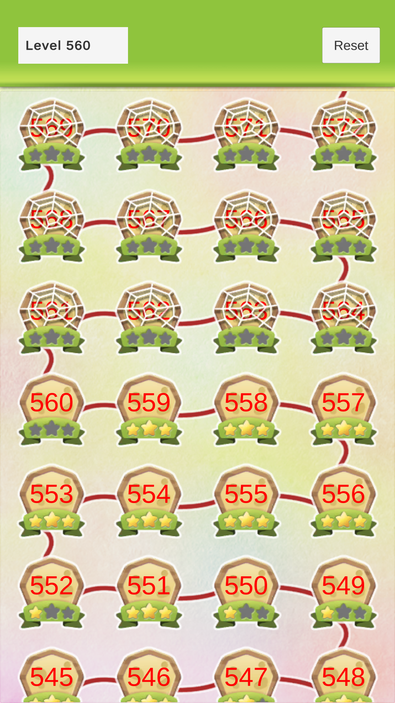
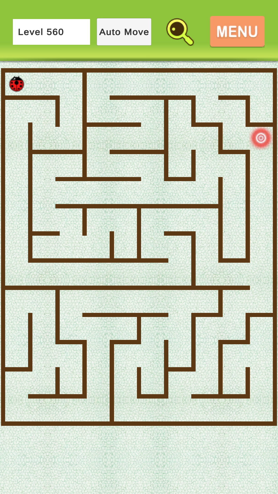
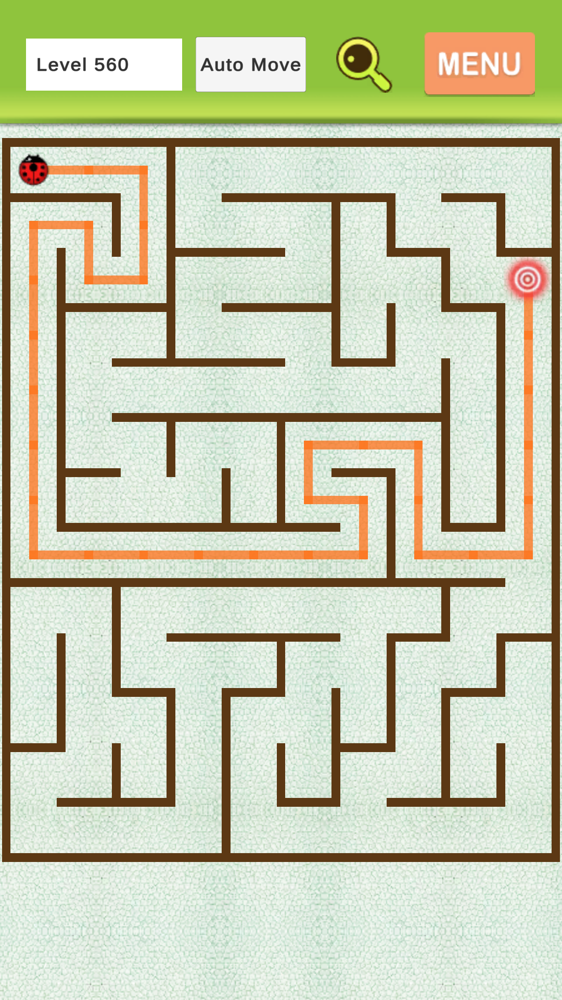

# Bug Maze Journey

Bug Maze Journey is a 2D Unity puzzle game where the player guides a bug through procedurally generated mazes. Each stage generates a deterministic maze, selects a reachable target, supports hint rendering, and unlocks progress on the stage map.

## Download

Download the latest Android build from GitHub Releases:

[Download APK](https://github.com/vahungx/bug-maze-journey/releases/latest)


## Screenshots

| Stage Map | Maze Gameplay | Hint Path |
| --- | --- | --- |
|  |  |  |

## Gameplay

- Explore a stage map with up to 999 stages.
- Each stage produces a deterministic maze from the stage index.
- The bug starts in the top-left cell and must reach a valid target cell.
- Hint mode renders the shortest path to the target.
- Auto-move follows the solved path and awards stars on completion.
- Progress and stars are saved locally.

## Tech Highlights

- Unity 6000.3.13f1
- 2D gameplay with SpriteRenderer and uGUI screens
- Procedural maze generation with DFS backtracking
- BFS pathfinding
- Addressables-based scene, UI, and prefab loading
- In-flight Addressables load cache to avoid duplicate handles
- Runtime pooling for map rows, maze walls, hint paths, and audio sources
- UniTask-based async flows for loading and UI transitions
- Service-oriented runtime bootstrap for UI, audio, local data, pooling, and addressables

## Project Structure

```text
Assets/_Project
|-- Art/                         # Source sprites and preview images
|-- Prefabs/
|   |-- Map/                     # Stage map row and star prefabs
|   |-- Maze/                    # Maze square prefab
|   `-- UI/                      # Screens, popups, loading views
|-- Scenes/
|   |-- Splash.unity
|   |-- 0.Loading.unity
|   |-- 1.Home.unity
|   `-- 2.Maze.unity
`-- Scripts/
    |-- LocalData/               # Map progress and saved stars
    |-- Map/                     # Virtualized stage map UI
    |-- Maze/                    # Maze generation, rendering, pathfinding, bug movement
    |-- Scenes/                  # Scene entry scripts
    |-- Shared/
    |   |-- Pooling/             # PoolManager and pooled item lifecycle
    |   `-- Services/            # Addressables, UI, audio, local data, bootstrap
    `-- UI/                      # Base UI, screens, popups, loading views
```

## Core Systems

### Maze

The maze flow is coordinated by `MazeController`:

1. Generate a deterministic maze from the stage index.
2. Render walls through `MazeRenderer`.
3. Select a reachable target through `MazeTargetSelector`.
4. Find a route with `MazePathfinder`.
5. Render hint segments through `PathRenderer`.
6. Move the bug along the path with `BugController`.

### Stage Map

`StageMapLayout` virtualizes the map list instead of instantiating every stage row. It lazy-loads the row prefab through Addressables, spawns rows through `PoolManager`, and refreshes row content as the user scrolls.

### Services

`GameServicesBootstrap` creates and registers shared services before scene load:

- `AddressableService`
- `UIService`
- `AudioService`
- `LocalDataService`
- `PoolManager`

These services are accessed through `ServiceLocator`.

## Addressables

Important runtime keys:

| Key | Purpose |
| --- | --- |
| `0.Loading` | Loading scene |
| `1.Home` | Home/stage map scene |
| `2.Maze` | Maze gameplay scene |
| `MapScreen` | Stage map UI screen |
| `MazeScreen` | Maze UI screen |
| `LoadingView` | Loading overlay |
| `WinPopup` | Win popup |
| `Square` | Maze wall/path sprite prefab |
| `StageMapRow` | Stage map row prefab |

Before making a build, rebuild Addressables if assets or groups changed.

## Requirements

- Unity Editor `6000.3.13f1`
- Android Build Support if building APKs
- Packages are managed through `Packages/manifest.json`

Key packages:

- Unity Addressables
- Unity Input System
- Universal Render Pipeline
- uGUI
- UniTask
- DOTween
- Odin Inspector

## Getting Started

1. Clone the repository.
2. Open the project with Unity `6000.3.13f1`.
3. Let Unity restore packages from `Packages/manifest.json`.
4. Open `Assets/_Project/Scenes/Splash.unity`.
5. Enter Play Mode.

## Build Guide

### Android APK

1. Install Unity Android Build Support.
2. Open `File > Build Profiles` or `File > Build Settings`.
3. Select Android.
4. Add these scenes in order:

```text
Assets/_Project/Scenes/Splash.unity
```

5. Build Addressables.
6. Build the APK.

Recommended release asset name:

```text
bug-maze-journey.apk
```

## Development Notes

- Use Addressables for UI, scenes, and prefabs loaded at runtime.
- Prefer `PoolManager` for frequently spawned gameplay objects.
- Keep maze/pathfinding allocations low; buffers are reused in runtime pathfinding.
- Check Unity Console after modifying scripts or Addressable groups.
- Keep scene keys in sync with `Constant.cs` and Addressables group names.

